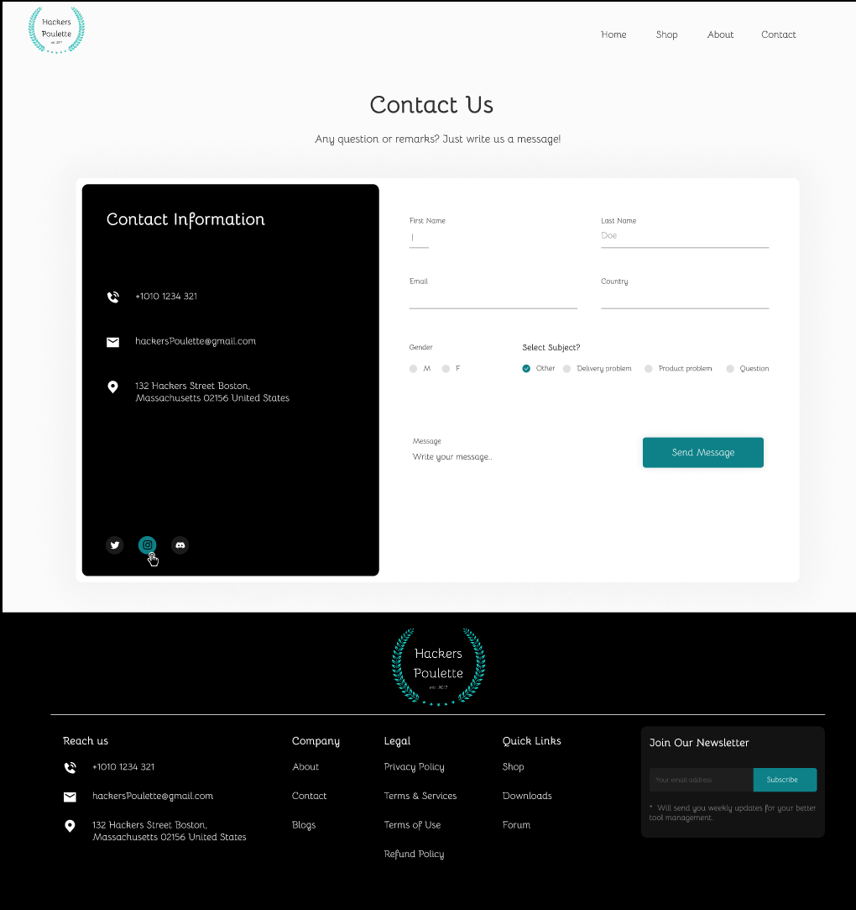

# Hackers Poulette

This project contain a PHP contact support form that process the received data.

It was made in november 2023 during a formation at BeCode. 


## Badges

[](https://choosealicense.com/licenses/mit/)
[](https://choosealicense.com/licenses/mit/)
[](https://choosealicense.com/licenses/mit/)


## Screenshots




## Run Locally

Clone the project

```bash
  git clone https://link-to-project
```

Go to the project directory

```bash
  cd my-project
```

Start the server

```bash
  php -S localhost:8000
```

